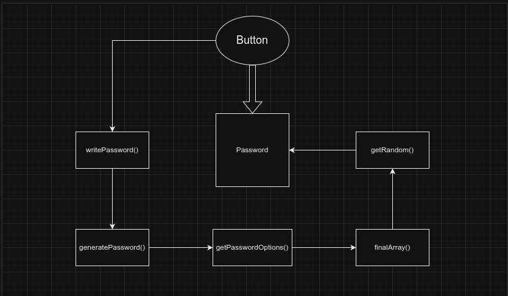
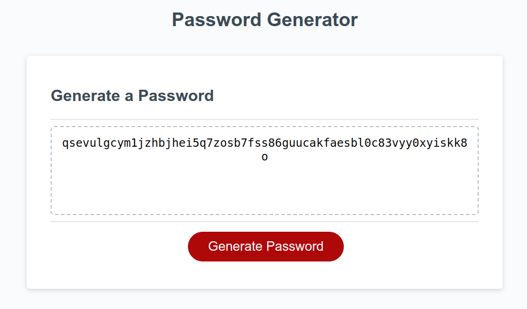

# Password Generator

An application that an employee can use to generate a random password based on criteria they’ve selected.

## Screenshots

Button click -> writePassword() -> generatePassword() -> getPasswordOptions() -> finalArray() -> getRandom() -> password

## License

MIT License

